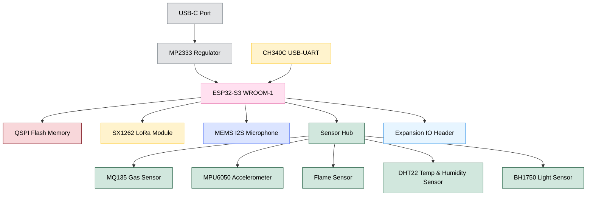

# 🚀 EnviroGuard-AI
### *A Smart, Modular Infrastructure Monitoring System Powered by Edge AI and ESP32-S3*

---

## 🌍 Overview
**EnviroGuard-AI** is a compact, modular, and powerful anomaly detection system built around the **ESP32-S3-WROOM-1** microcontroller. Designed specifically for smart infrastructure applications, this system brings together multiple environmental sensors, long-range wireless communication, and Edge AI capabilities.

With its **professionally designed 4-layer PCB**, onboard **LoRa (SX1262)**, **QSPI Flash** for TinyML models, and **I2S audio input**, it's ideal for detecting gas leaks, vibrations, fire hazards, and abnormal sounds in real-time. Its modular design makes it perfect for quick prototyping or field deployment.

---

## 🌟 Project Highlights
- 🛠️ Fully custom 4-layer **PCB designed in KiCad 7.0**
- 🔌 Powered via **USB-C** with onboard **CH340C USB-to-Serial** interface
- 💾 Includes **QSPI Flash** for storing Edge AI/TinyML models
- 🎤 Audio anomaly detection via **I2S MEMS microphone**
- 🌫️ Onboard sensors for gas, temperature, humidity, vibration, flame, and light
- 📡 Long-range communication using **SX1262 LoRa module**
- 🔋 Designed for **low-power, high-reliability** use cases
- 🧩 Modular expansion header for future hardware integrations

---

## 📌 GPIO Pinout & Connections

| GPIO Pin | Connected To         | Function / Role                    |
|----------|----------------------|------------------------------------|
| GPIO0    | SW_BOOT              | Boot mode selection                |
| GPIO1    | CH340C RXD           | UART TX                            |
| GPIO3    | CH340C TXD           | UART RX                            |
| GPIO10   | LED_STATUS           | Status LED                         |
| GPIO4    | MQ135_DATA           | Gas Sensor                         |
| GPIO5    | BH1750_SCL           | Light Sensor (I2C) Clock           |
| GPIO6    | EXP_IO1              | Expansion GPIO                     |
| GPIO12   | MPU6050_SDA          | I2C Data (Accelerometer)           |
| GPIO17   | MPU6050_SCL          | I2C Clock (Accelerometer)          |
| GPIO18   | FLAME_DO             | Flame Sensor Digital Out           |
| GPIO19   | MIC_CLK              | I2S Clock                          |
| GPIO20   | MIC_DATA             | I2S Data                           |
| GPIO21   | DHT22_DATA           | Temp & Humidity Sensor             |
| GPIO24   | LORA_BUSY            | LoRa Busy Pin                      |
| GPIO25   | LORA_MOSI            | SPI MOSI                           |
| GPIO26   | LORA_MISO            | SPI MISO                           |
| GPIO31   | LORA_NSS             | LoRa CS                            |
| GPIO32   | LORA_SCK             | SPI Clock                          |
| GPIO34   | LORA_IRQ0            | LoRa Interrupt                     |
| GPIO36   | LORA_RST             | LoRa Reset                         |
| GPIO35   | EXP_IO5              | Expansion GPIO                     |
| EN       | EN Switch            | Reset Circuit                      |

---

## 🧠 System Architecture




---

## 🧩 Component Summary

| No. | Component              | Interface | Description                             |
|-----|------------------------|-----------|-----------------------------------------|
| 1   | ESP32-S3-WROOM-1       | -         | Main MCU with AI, BLE, WiFi             |
| 2   | SX1262 LoRa Module     | SPI       | Long-range wireless communication       |
| 3   | MEMS I2S Microphone    | I2S       | Captures audio for analysis             |
| 4   | MQ135                  | Analog    | Gas and air quality sensing             |
| 5   | MPU6050                | I2C       | Vibration/motion detection              |
| 6   | DHT22                  | Digital   | Temperature & Humidity                  |
| 7   | BH1750                 | I2C       | Ambient light measurement               |
| 8   | Flame Sensor (4-pin)   | Digital   | Detects flame or fire presence          |
| 9   | CH340C                 | UART      | USB-to-Serial for flashing and debug    |
| 10  | QSPI Flash (W25Q32JV)  | QSPI      | Stores ML models for inference          |
| 11  | USB-C Port             | Power     | Power and programming port              |
| 12  | MP2333 Regulator       | Power     | Converts 5V to 3.3V efficiently         |
| 13  | Expansion Header       | GPIO      | Breakout pins for add-ons and testing   |

---

## 📁 Folder Structure
```bash
EnviroGuardAI/
├── Schematic/
│   └── EnviroGuardAI.kicad_sch
│   └── EnviroGuardAI.pdf
├── PCB/
│   └── EnviroGuardAI.kicad_pcb
│   └── Gerbers/
│       ├── F_Cu.gbr, Drill.drl, etc
├── Firmware/
│   └── main.cpp / main.py
├── Libraries/
│   └── Custom.pretty
├── Images/
│   ├── Board_3DView.png
│   ├── Top_Layer.png
│   └── Bottom_Layer.png
├── README.md
└── .gitignore
```

---

## 🌱 Future Improvements
- Add a buzzer or RGB LED for better visual/audio alerts
- Enable deep sleep mode to save power during idle states
- Integrate a solar charging module (e.g., TP4056 or BQ24210)
- LoRaWAN gateway integration with cloud sync
- Run a trained ML model for local anomaly classification
- Add a companion web dashboard or mobile app

---

## 🌐 License
This project is released under the **MIT License**. You’re free to use, modify, and share it as you like.

---

## 🤝 Contributions & Feedback
- Found an issue? Open a GitHub issue.
- Have ideas or want to contribute? Pull requests are welcome.
- Collaborators in AI, IoT, or hardware design — feel free to connect!

---

**Let’s build a smarter, safer world with modular edge intelligence — one node at a time. ✨**
